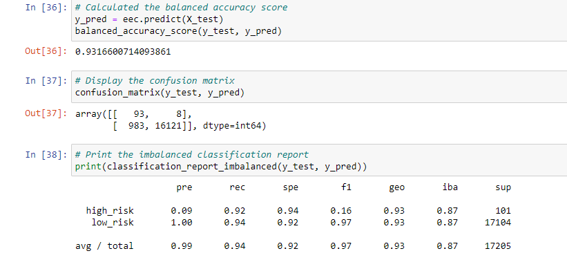

# Credit_Risk_Analysis

## Overview

This analysis was created in order to predict whether a person would have low or high credit risk using difference machine learning models in order to obtain the most accurate results. 

## Results

Based on the results of the machine learning using different model, here are the results:

### Random Oversampling

- average balanced accuracy score
- very poor precision score on high risk and very good precision score on low risk
- average recall scores

### SMOTE Oversampling

- Negligeable improvement of balanced accuracy score over random oversampling
- very poor precision score on high risk and very good precision score on low risk
- average recall scores

### ClusterCentroids Undersampling

- Worse accuracy score of all models, barely over 50%
- very poor precision score on high risk and perfect precision score on low risk
- Bad recall score on low risk (less than 50%) with slightly better recall score on high risk

### SMOTEENN under/over sampling

- Negligeable improvement of balanced accuracy score over SMOTE Oversampling
- very poor precision score on high risk and perfect precision score on low risk
- average recall score on low risk with better recall score on high risk

### Balanced Random Forest Classifier

- Considerable improvement of accuracy score compared to the resamplign models
- very poor precision score on high risk and perfect precision score on low risk
- Good recall score on both high risk and low risk

### Easy Ensemble AdaBoost Classifier

- Best accuracy score of all models
- very poor precision score on high risk and perfect precision score on low risk
- Very good recall score on both high risk and low risk

## Summary
To summarize the results, the resampling models did considerably worse than the ensemble models, with the undersampling model doing the worse and the SMOTEEN model doing the best. The Easy Ensemble AdaBoost Classifier did the best out of all the models, with a near perfect accuracy and recall score. All models had very bad precision score on high risk. 
Because of the above reasons, I recomment the Easy Ensemble AdaBoost Classifier model. 
